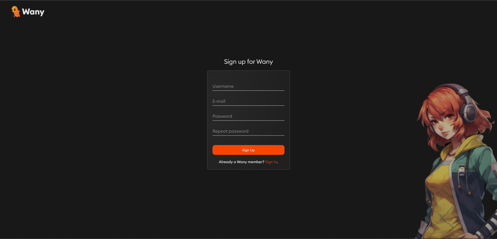
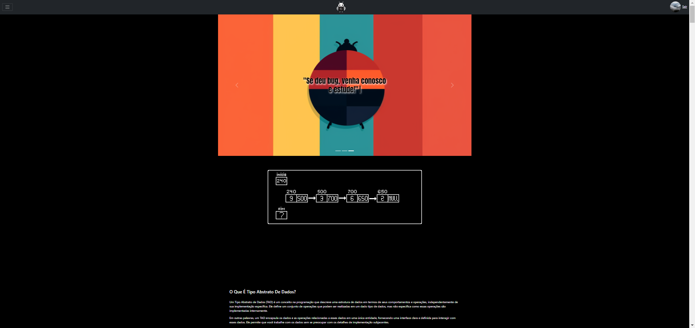
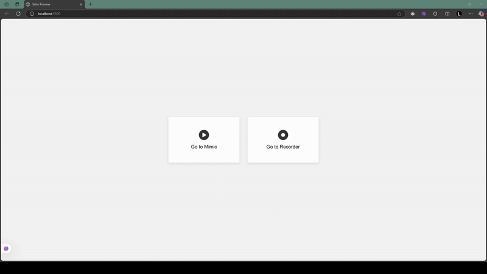
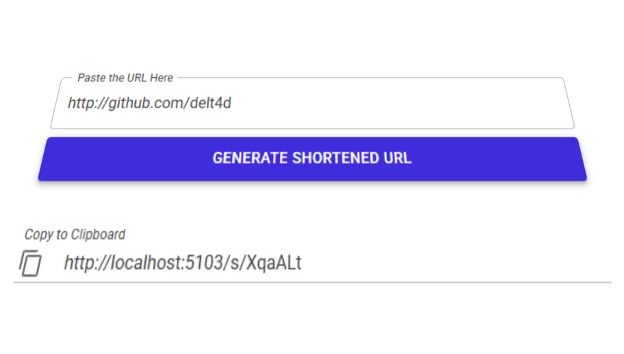
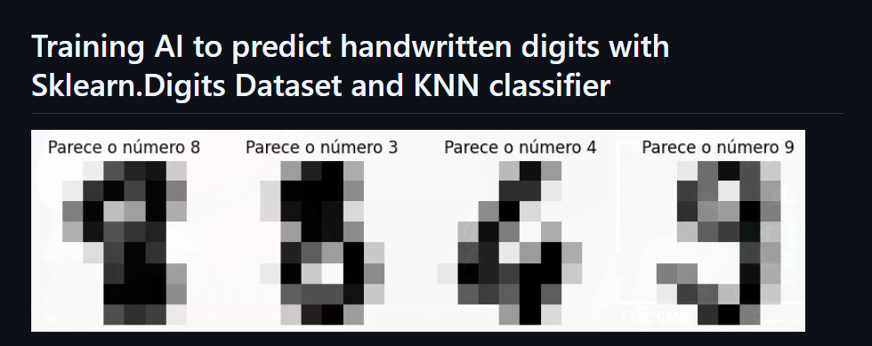
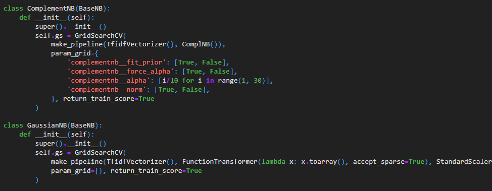
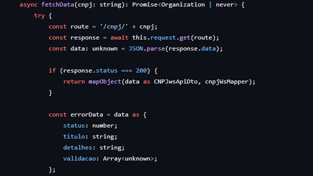
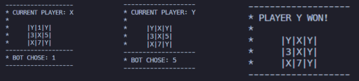

# Hello!

I am a fullstack .NET and NodeJS developer with a degree in Systems Analysis and Development. I know some technologies, that include ReactJS, NodeJS, Docker, NestJS and programming languages, like C#, Javascript/Typescript, Python and PHP.

  

    

  

  

 

# Have a look.

### [Wany.](https://github.com/Wany-Studios/Wany)
Wany is a web-based game streaming platform focused on indie games exported to run in the browser. It allows users to play without downloads and supports a monetization model where developers earn based on player engagement, with optional subscription plans and ads helping fund payouts.

### [Thebug Plataforma.](https://github.com/delt4d/thebug-plataforma)
A PHP application that provides explanations and quizzes on data structures, including Singly Linked List, Doubly Linked List, Binary Search Tree, B-Tree, Trie, AVL Tree, and Red-Black Tree. Users can study each structure and test their understanding through integrated quizzes.

### [Echo: User Interactions Recorder and Mimic.](https://github.com/delt4d/Echo)
A tool designed to record and replicate user interactions within applications. Built using JavaScript, HTML, and C#, it aids in automating UI testing and analyzing user behavior by mimicking recorded actions.

### [URL Shortener](https://github.com/delt4d/Url-Shortener)
ASP.NET Core and Blazor project to generate shorten URLs.

### [E-commerce Project: Book Store.](https://github.com/delt4d/Projeto-Ecommerce)
Developed as part of the Design Patterns class, this PHP-based project showcases the implementation of various design patterns in building an e-commerce platform.

### [K-Nearest Neighbor Digits Classifier With Python and Sklearn.](https://github.com/delt4d/Handwritten-Digits-Prediction)
This project utilizes the K-Nearest Neighbors (KNN) algorithm to classify handwritten digits from the sklearn.digits dataset. Implemented in Python, it serves as an introduction to machine learning and pattern recognition techniques.

### [Naive Bayers Self-Admitted Technical Debt Comments Classifier.](https://github.com/delt4d/SATD-Sentiment-Classifier)
A project that employs the Naive Bayes algorithm to classify sentiments in self-admitted technical debts.

### [EstagioHub Backend.](https://github.com/delt4d/EstagioHub/tree/main/back-end)
Backend for EstagioHUB, a platform that manages the internship process — from submitting progress reports to handling documents with digital signatures — for students and educational institutions.

### [Neural Network TicTacToe.](https://github.com/delt4d/TicTacToe-Neural-Network)
An implementation of the classic TicTacToe game where the AI opponent is powered by a neural network.

